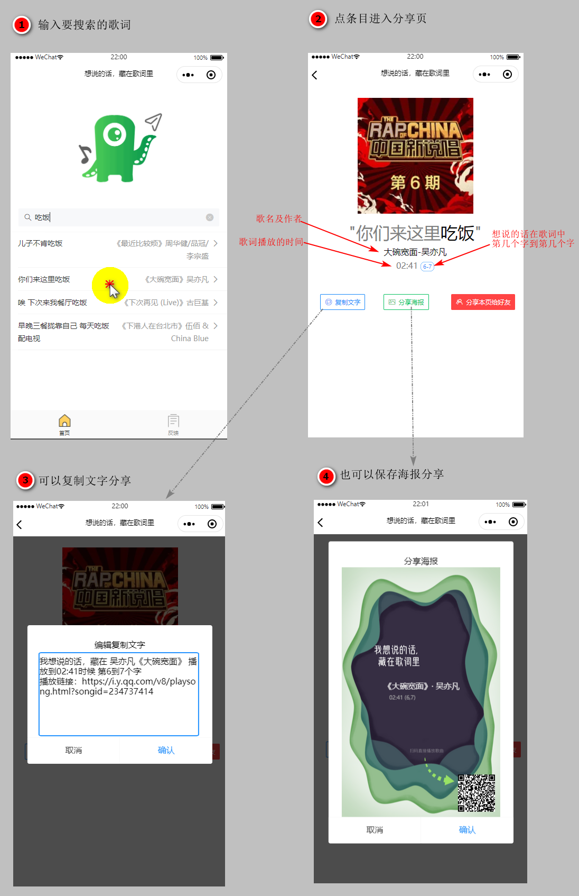

# lyric-msg

> 想说的话，藏在了歌词里

#### :rocket:简介

现在已经有那么多的歌，那么<u>肯定有一些我们想说的话已经包含在现有的歌词中</u>了。当有一些难以启齿的话，或者为了增加一点乐趣（或者傻吊气氛），就可以不直接说出来想说的话，而是的说出<u>想说的话在藏在歌的位置</u>，所以就开发了这么一个小程序

#### :aerial_tramway:用法

#### :man_scientist:技术框架

前端：mpvue+vant+flyio

后端：Django+RESTful API

#### :apple:成果

#### :alarm_clock:ChangLog

| 日期      | 版本  | 备注               |
| --------- | ----- | ------------------ |
| 2020.6.10 | 1.0.0 | 初步完整框架，测试 |
|           |       |                    |
|           |       |                    |

